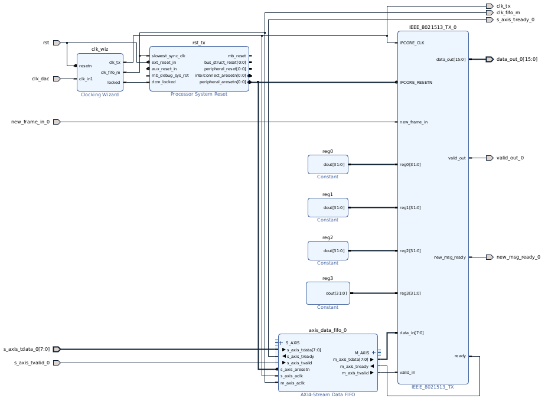
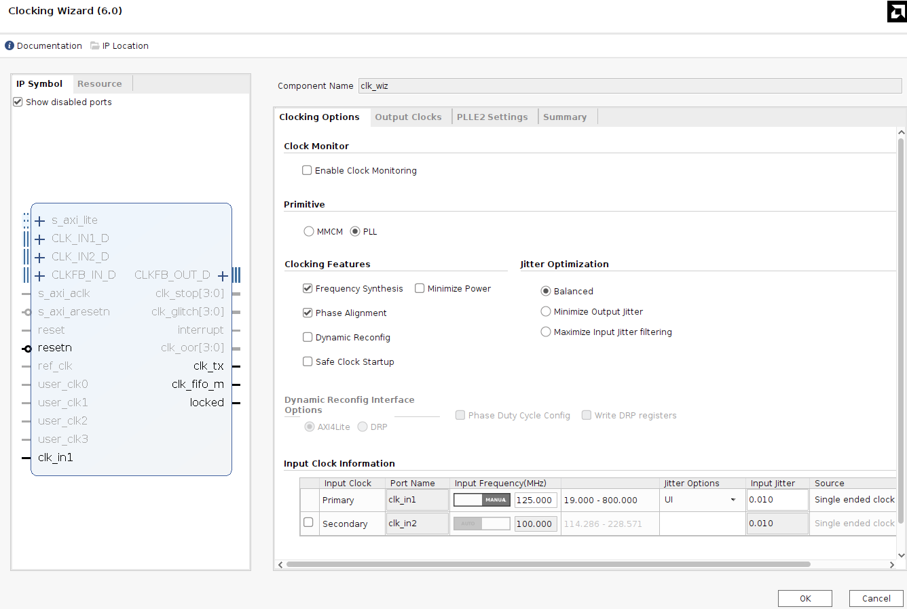
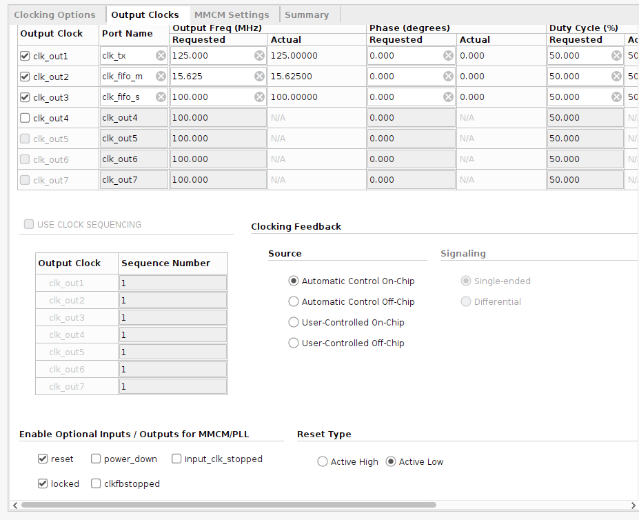
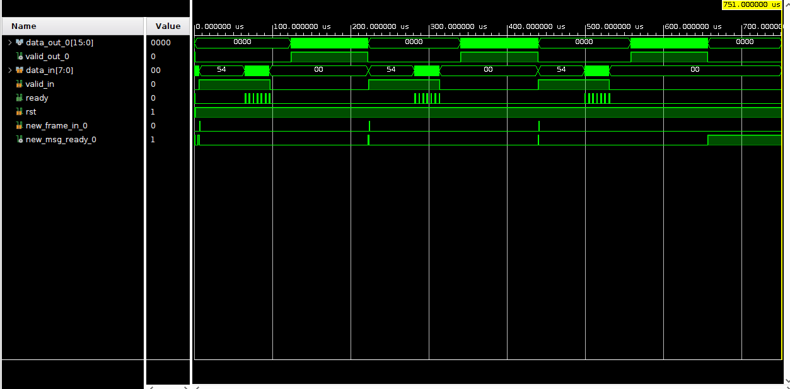
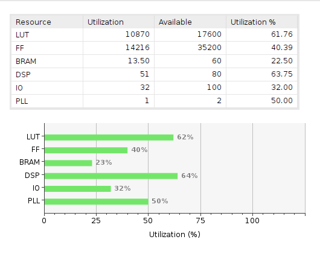
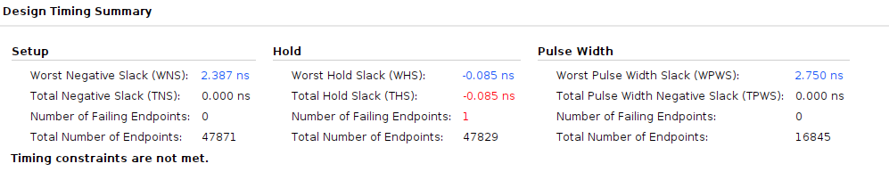

# Transmisor

Documento que indica todo lo necesario para usar el transmisor **IEEE_8021513_TX**.

## Funcionalidades probadas

* Máximo tamaño transmisible por trama: mínimo (TODO probar).

## Clocks

* **clk_ext**: [100 MHz]. Clock del procesador ZYNQ (puede tomar otro valor).

* **clk_tx**: [125 MHz]. Clock del transmisor. Sincrónico con la salida del transmisor.

* **clk_fifo_s**: [100 MHz]. Clock para cargar datos a la FIFO (puede tomar otro valor).

* **clk_fifo_m**: [15.625 MHz]. Clock para sacar datos de la FIFO. Sincrónico con la entrada del transmisor.

## Entradas

* **IPCORE_CLK**: [clk]. Señal de clock de 125 MHz.

* **IPCORE_RESETN**: [bool]. Señal de reset ACTIVE LOW ('0' para resetear).

* **new_frame_in**: [bool]. Indica que hay un nuevo mensaje a transmitir.

* **[reg0, reg1, reg2, reg3]**: [uint32_t]. Registros de configuración.

* **data_in**: [uint8_t]. Datos a transmitir. Se espera que sean recibidos de una interfaz AXI4 Stream de 8bits.

* **valid_in**: [bool]. Momento en que los datos recibidos son válidos (señal de AXI4 Stream).

* **last_frame**: Señal *TLAST* de AXI4 Stream. Indica que es el último elemento de este paquete de transmisión.

### Registros

Al recibir la señal "new_frame_in", se van a leer los registros de 32bits (reg0, reg1, reg2 y reg3) durante solamente un ciclo de clock, por lo que los registros pueden cambiar de valor durante la transmisión de un mensaje. Los registros quedan definidos como sigue:

| Register | 31 | 30 |   29   |   28   |   27   |    26   |    25   |    24   |  23 |  22 |  21 |  20 |  19 |  18  |  17  |  16  |  15 |  14 |  13 |  12  |  11  |   10  |   9   |   8   |  7 |  6 |  5 |  4 |  3  |  2  |    1   |    0   |
|:--------:|:--:|:--:|:------:|:------:|:------:|:-------:|:-------:|:-------:|:---:|:---:|:---:|:---:|:---:|:----:|:----:|:----:|:---:|:---:|:---:|:----:|:----:|:-----:|:-----:|:-----:|:--:|:--:|:--:|:--:|:---:|:---:|:------:|:------:|
|   0x00   |  x |  x |    x   |    x   |    x   |    x    |    x    |    x    | p23 | p22 | p21 | p20 | p19 |  p18 |  p17 |  p16 | p15 | p14 | p13 |  p12 |  p11 |  p10  |   p9  |   p8  | p7 | p6 | p5 | p4 |  p3 |  p2 |   p1   |   p0   |
|   0x04   |  x |  x |    x   |    x   |    x   |    x    |    x    |    x    |  x  |  x  |  x  |  x  |  x  |   x  |   x  |   x  | m15 | m14 | m13 |  m12 |  m11 |  m10  |   m9  |   m8  | m7 | m6 | m5 | m4 |  m3 |  m2 |   m1   |   m0   |
|   0x08   |  x |  x |    x   |    x   |    x   | concat2 | concat1 | concat0 |  x  |  x  |  x  |  x  |  x  | rep2 | rep1 | rep0 |  x  |  x  |  x  |   x  |   x  | rate2 | rate1 | rate0 |  x |  x |  x |  x |  x  |  x  | block1 | block0 |
|   0x0c   |  x |  x | mimon2 | mimon1 | mimon0 |  mimos2 |  mimos1 |  mimos0 |  x  |  x  |  x  |  x  |  x  |  cp2 |  cp1 |  cp0 |  x  |  x  |  x  | bat4 | bat3 |  bat2 |  bat1 |  bat0 |  x |  x |  x |  x | si3 | si2 |   si1  |   si0  |

* **p[23:0]**: *psduSize*. Tamaño en bytes del mensaje a transmitir.

* **m[15:0]**: *messageDuration*. En vez de usarse para indicar el tiempo que demora la transmisión, este parámetro se usa para indicar la cantidad de bytes "extra" agregados en la transmisión, para que sea múltiplo de "payloadBitsPerBlock0 = 120".

    Por ejemplo: si su mensaje es de 100 bytes, entonces (psduSize = 100; messageDuration = 20).

    Si su mensaje es de 300 bytes, entonces (psduSize = 300; messageDuration = 60).

    Si bien el mensaje "real" tiene un tamaño fijo, el mensaje escrito en la FIFO de entrada debe ser un múltiplo de 120 bytes.

* **block[1:0]**: *blockSize*. Siempre "00".

* **rate[2:0]**: *fecRate*. Siempre "001".

* **rep[2:0]**: *repetitionNumber*. Siempre "001".

* **concat[2:0]**: *fecConcatenationFactor*. Siempre "000".

* **si[3:0]**: *scramblerInitialization*. Cualquier valor (testeado con "1111").

* **bat[4:0]**: *batId*. Siempre "00010".

* **cp[2:0]**: *cyclicPrefixId*. Cualquier valor menos "000". (testeado con "001").

* **mimos[2:0]**: *explicitMimoPilotSymbolCombSpacing*. Cualquier valor (se puede usar para cualquier cosa).

* **mimon[2:0]**: *explicitMimoPilotSymbolNumber*. Cualquier valor (se puede usar para cualquier cosa).

## Outputs

* **data_out**: [fi(1,14,13)]. Valores de salida, para el DAC.

* **valid_out**: [bool]. Indica que el valor de salida es válido.

* **ready**: [bool]. Señal del AXI4-Stream. Indica que está listo para leer de la FIFO los dayos del payload.

## Modo de uso

1. Escribir en la FIFO el mensaje a transmitir. Si bien el mensaje puede ser de "x" bytes (incluyendo 0 bytes), tenga en cuenta que lo que se escriba en la FIFO debe ser un múltiplo de 120 bytes (completar con '0' de ser necesario).

2. Setear los registros reg0, reg1, re2 y reg3.

3. Levantar la señal `new_frame_in` duante un ciclo de clock de "clk_fifo_s". A partir de este punto, los registros pueden ser modificados sin problemas.

4. Esperar mientras se procesan el preambulo y encabezado.

5. Se va a levantar la señal de `ready` y va a empezar a leer la FIFO la cantidad de bytes indicada por los registros.

6. Esperar mientras se forma el símbolo OFDM.

7. Se envía a la salida una señal continua de 125MHz lista para conectarse al DAC. Se indica su validez con la señal `valid_out`.

8. No se puede levantar otra señal de `new_frame_in` hasta el falling_edge de la señal `valid_out`.

## Block Design

Resets separados para la FIFO y para el IP-Core.

## Simulación

Critical warnings: 0.

## Sintesis

Importante: agregar el archivo de constraints al proyecto de Vivado, el cual se encuentra dentro del Ip Core bajo la carpeta `constraint/ieee_constraints.xdc`.

Critical warnings: 0.

Para el timing, no cumple el tiempo de hold de la FIFO. Esto debería revisarse una vez que se haga la implementación. En el peor de los casos, la frecuencia de clock del esclavo de la FIFO debería de disminuirse.

## Implementacion

Error: ""

## Historial de versiones

### v1.2

Se agrega mención al archivo de constraints.

### v1.1

Se agrega especificación del tamaño de "120 bytes" múltiplo del mensaje.

### v1.0

Creación inicial del documento
