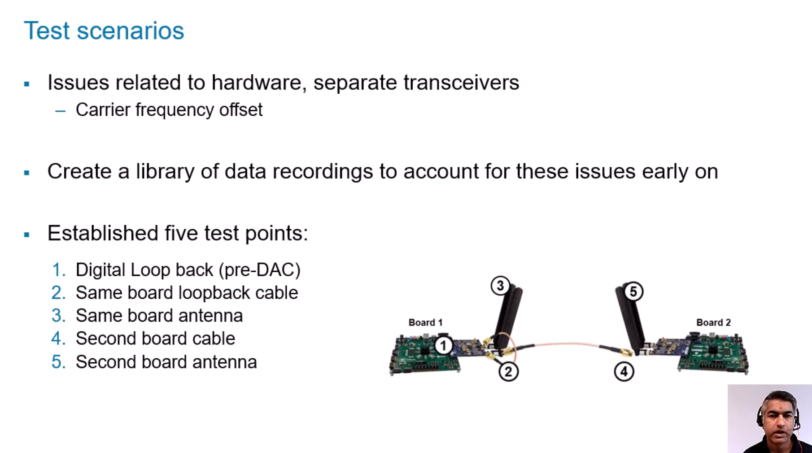
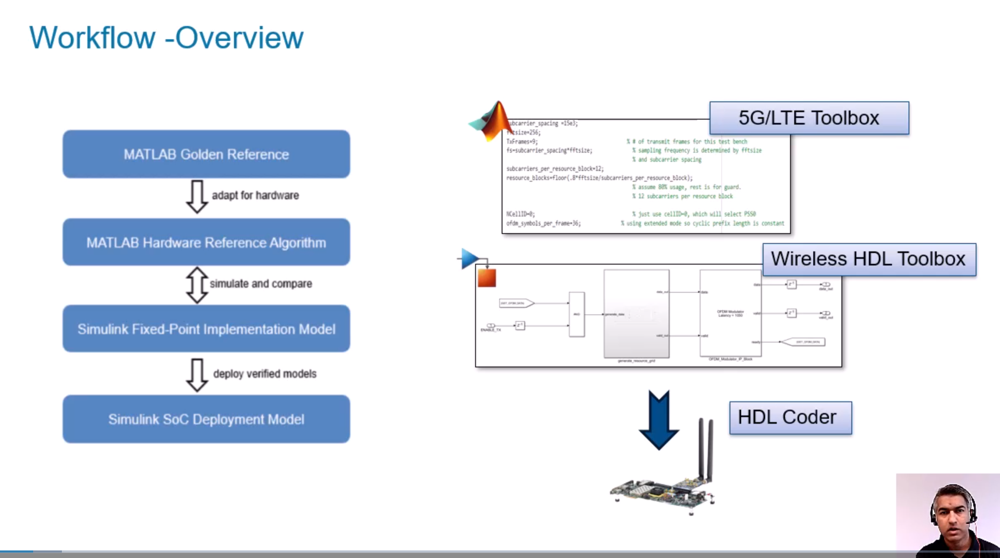
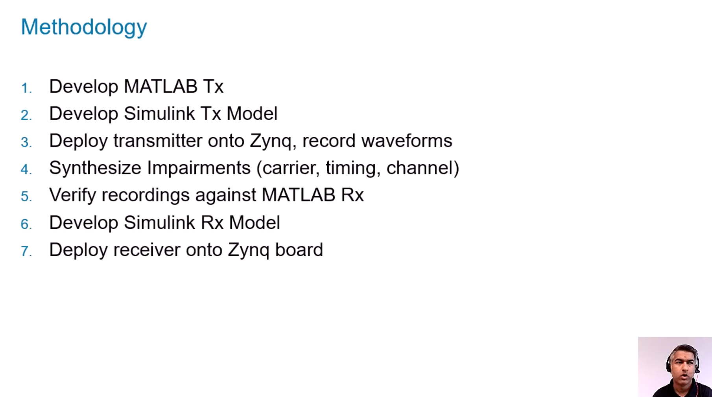
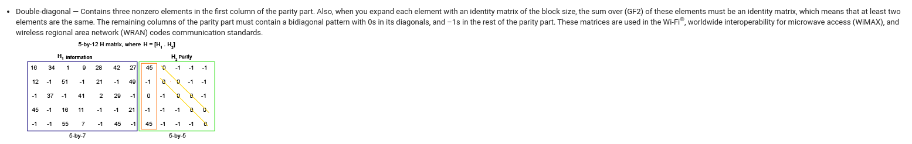

# DC-OFDM

DC-OFDM implementation on Matlab/Simulink, for HDL Coder generation.

## Pasos a seguir

## Cambios respecto de la IEEE

En esta sección voy a comentar todos las modificaciones que fueron necesarias hacer respecto del estándar IEEE 802.15.13.

### Cambio de las matrices LDPC

El bloque de Matlab [LDPC Encoder](https://la.mathworks.com/help/wireless-hdl/ref/ldpcencoder.html) solamente recibe matrices "dual diagonal". Las matrices del estándar fueron modificadas para que sean reconocidas por este bloque de la siguiente forma:

* En la primer columna de la matriz cuadrada de paridad, formada por "0", "-1" y dos veces un número "x", se ubica el número "x" en la primera y última fila.

* En la segunda columna de la matriz cuadrada de paridad, se reemplaza el número "x" de la última fila por un "-1".

