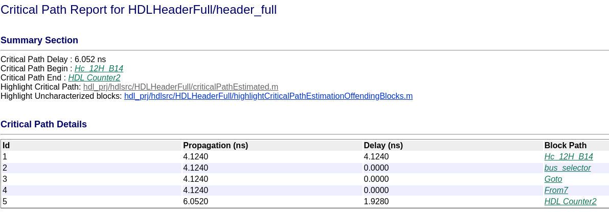
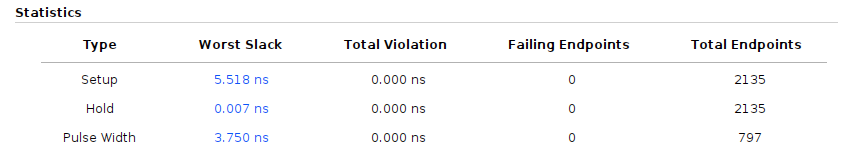
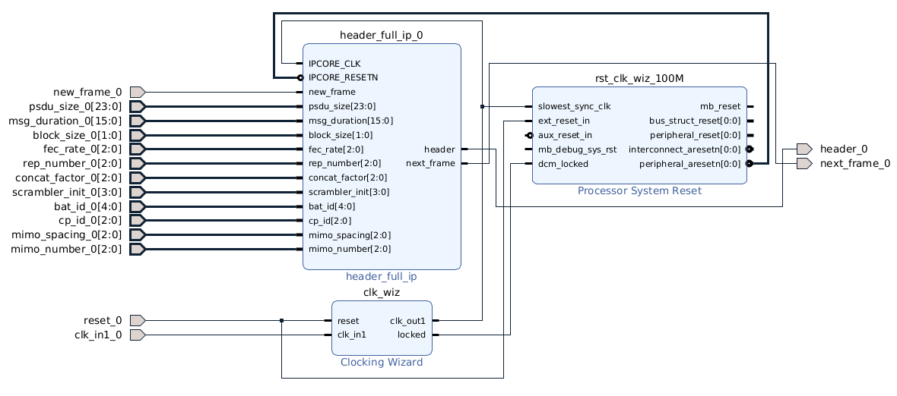

# Optimización del header

La frecuencia máxima del bloque es de 100MHz.

## Primer tirada sin optimizaciones

En una primera instancia, queremos ver cómo se comporta el bloque sin ningún tipo de optimización.

Según Simulink, el camino crítico consume 6.052 ns == 165.23 MHz, que está por encima de lo necesario

Ahora bien, quiero chequear que este valor se condice con lo que dice Vivado.

Como podemos ver, Vivado dio un slack incluso un poco menor al de Matlab.

No hace falta optimizar este bloque.

Nota: el IP Core generado no tiene la salida de "ctrl_out" porque ese tipo de bus con tres señales juntas no es compatible.

