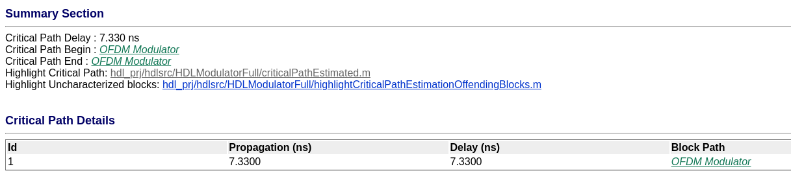
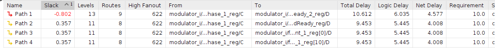
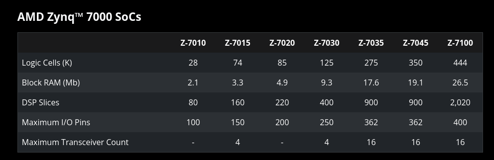
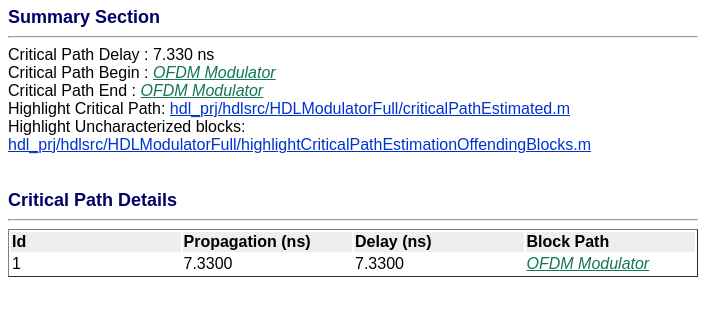
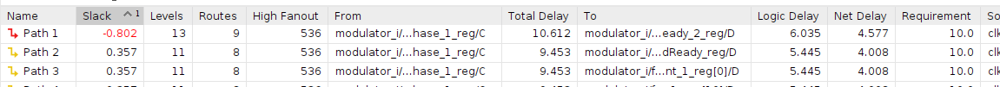
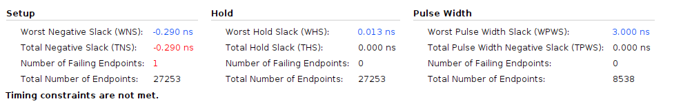
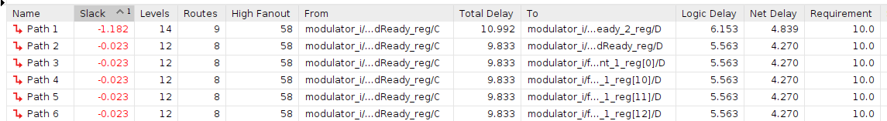
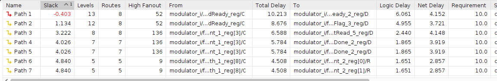
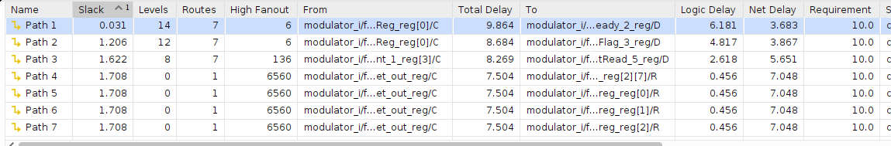

# Modulator optimization

Al compilar sin optimizaciones, obtenemos un buen resultado.

El camino crítico aparece en la entrada del modulador de OFDM, por lo que me es sencillo agregar delays a la entrada del bloque y correr devuelta la compilación.

Haciendo eso, ganamos algunos décimas de nanosegundo extras. Ya la limitación la impone el bloque modulador de OFDM, por lo que no se puede hacer más al respecto.

Ahora, utilizando los tres tipos de pipelining, no cambia el camino crítico, y la simulación corre bien. Esto es porque el camino crítico dependía del bloque OFDM, el cual no puede ser optimizado.

## Sintesis raw

Sintetizo el componente, y veo si da el timing:

Como podemos ver, no da el timing para el modulador OFDM, así que le bajo la cantidad de bits a 10 decimales en vez de catorce.

Por qué 10 decimales?

Para eso, tenemos que hablar de los componentes que forman una FPGA.

La FPGA ZYNQ 7000 tiene 28K "Logic cells" y 80 "DSP Slices".

"Logic cells" son LUTS de 6 entradas y 8 flip-flops. Por lo tanto, nos conviene trabajar con "múltiplos de 6" -> 10 decimales, signo y parte entera.

Después el DSP48 te permite hacer operaciones de hasta 48 bits, por lo que se pueden implementar dos sumas de 24 bits, o 4 sumas de 12 bits -> conviene que el número tenga 12 bits.

## Usando numeros de 12 bits

Usando el tipo de dato `fixdt(1,12,10)`, obtengo esto en Matlab. No cambio mucho su análisis, lo cual es de esperarse que no cambie el valor de "logic delay", pero sí de "net delay".

Este es el resultado de la síntesis:

Este es el resultado de la implementación.

Lo que llama mucho la atención es que le resultado de la síntesis no cambio, salvo el valor de "fanout" (lo cual era de esperarse). Pero hubiese esperado que hubiese bajado también el valor de "net delay", y no cambió.

Cambiar el diseño agregando delays parece que tampoco ayudó.

Pero es ahora que nos damos cuenta de algo: ok, el diseño no cumple timing, pero no cumple timing para un clock de 100 MHz, mientras que el modulador de OFDM corre a un clock de 50MHz. Por lo que en realidad el timing debería cumplirlo sin problemas.

Por lo tanto, desactivo "clock-rate pipelining" y activo "enable-based constraints". Para referencia, clock-rate pipeling hace que todos los bloques del código corran a 100 MHz, repitiendo muestras, mientras que "enabled-based constraints" le asigna un clock separado a cada elemento, y corre constraints de timing contra el clock en el cual verdaderamente corren.

Se agregó el archivo de constraints, pero no cambió el modo de operación.

Se cambió el bloque "constellation scrambler", de modo que ya no opera a un clock distinto, sino que salta "dos pasos" por clock de 50MHz. Se espera que al hacer este cambio, pueda optimizar el ruteo, así como la opción "enabled-constraints" pueda separar los dos clocks de la señal.

Parece que esa ópcion realmente ayudo a mejorar los problemas de timing, salvo por un camino crítico bastante molesto:

Ese camino crítico es el que va desde la señal de "valid_in" de la entrada del bloque del modulador OFDM, hasta la salida "ready". Al ser un bloque de Matlab, no se pueden agregar delays desde Matlab ni optimizar más. Vamos a tener o que modificar el HDL a mano, o bien hacer la implementación a mano.

Sin embargo, este diseño así implementado es lo suficientemente bueno como para que el timing de en implementación!!

