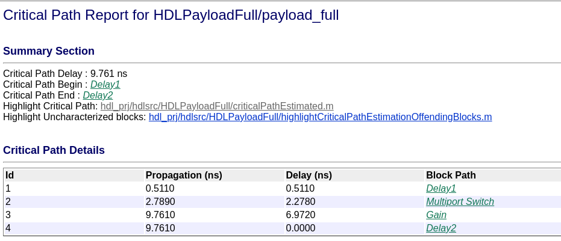
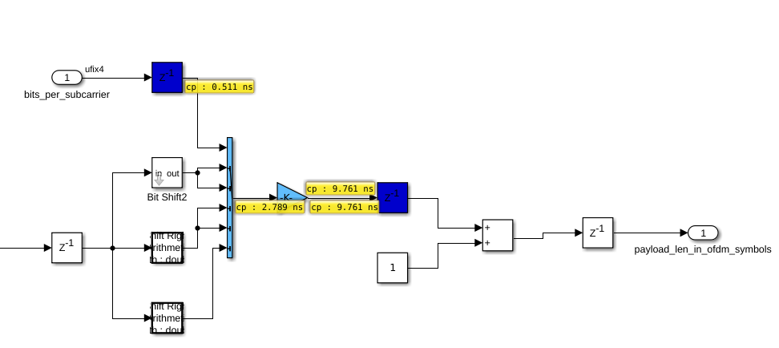
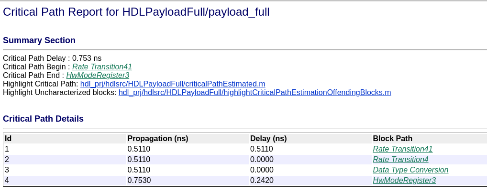
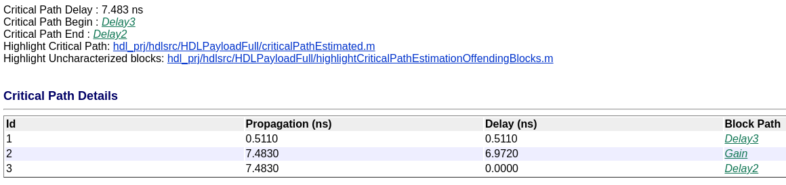
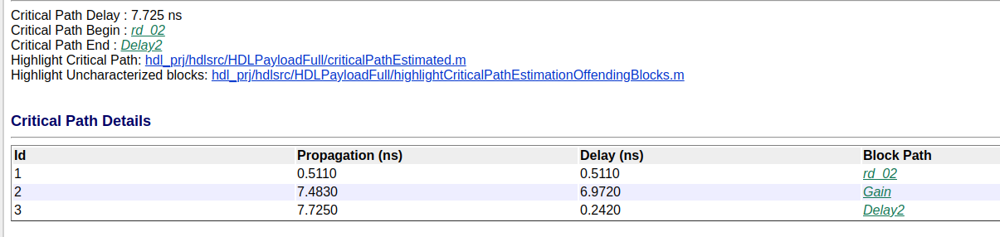
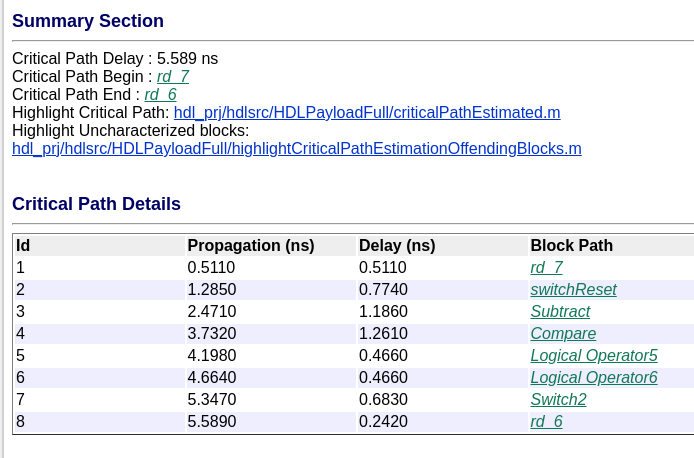
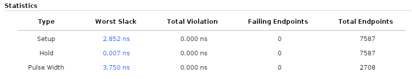

# Optimización del payload

## Caso simple

Al correr la optimización, vemos que la constraint de tiempo cumple apenas.

## Caso Optimización full

Ahora, vamos a probar con optimizaciones, y ver si mejora. Seteamos:

* Clock Rate pipelining.
* Clock rate distribution.
* Clock rate adaptation.

Claro que hacer esto no es gratis, ya que varios delays fueron agregado al diseño que podrían, o no, modificar la lógica final del diseño.

Al correr el test del payload, pero usando como entrada el archivo `gm_HDLPayloadFull.slx`, el test falla.

Por lo tanto, está bueno ver en dónde fueron agregados delays, y ver qué se puede cambiar, pero no se puede confiar en la optimización "ciega" de Matlab.

Por ejemplo, luego de agregar algunos delays en los lugares mas críticos (antes y después de multiplicadores y sumadores), y chequear que los tests seguían funcionando correctamente, se redujo en un par de nanosegundos el slack de setup crítico, compilando sin optimizaciones.

Ahora, añadamos optimizaciones y veamos cual de todas ellas termina rompiendo.

**Clock Rate pipelining** no rompe (no puede ser usado solo, es decir, activar esta opcion sin las otras es lo mismo que nada).

**Clock Rate Distribution + Clock Rate Pipelining**: No rompe, pero tampoco mejoró mucho el timing. Es más, el timing es pero que antes:

**Todos los clock rate**: El timing cumplió.

El resultado en Vivado no es tan optimista como en Matlab, pero sirve.

