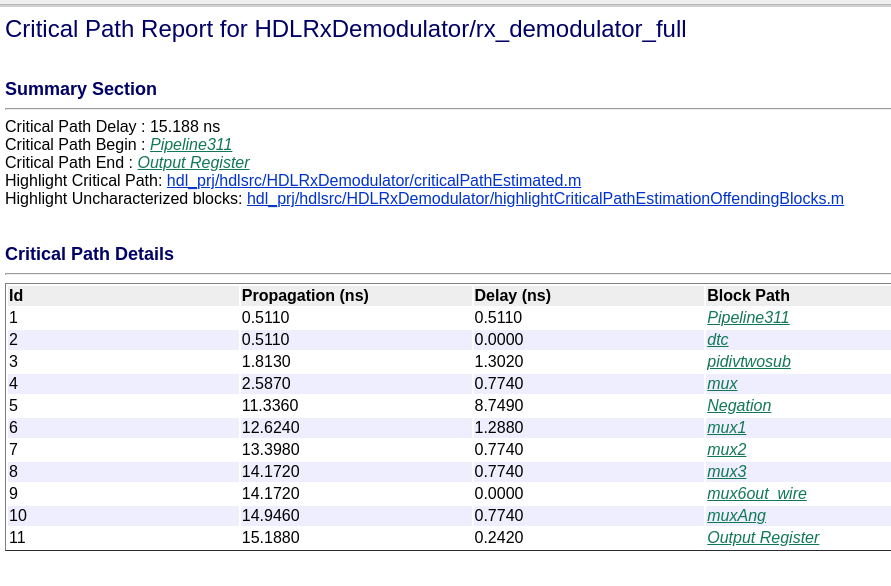
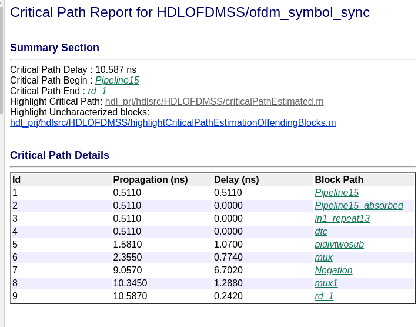
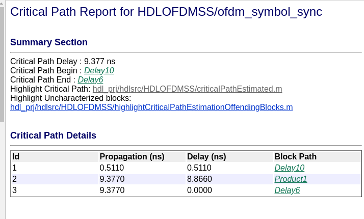
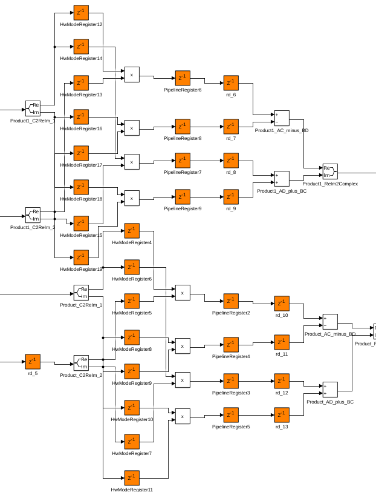
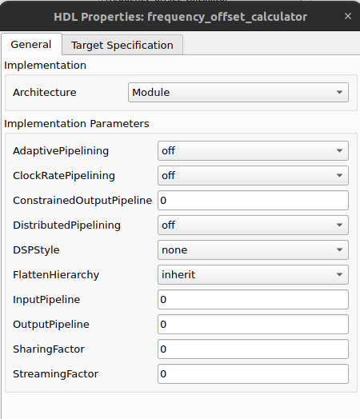
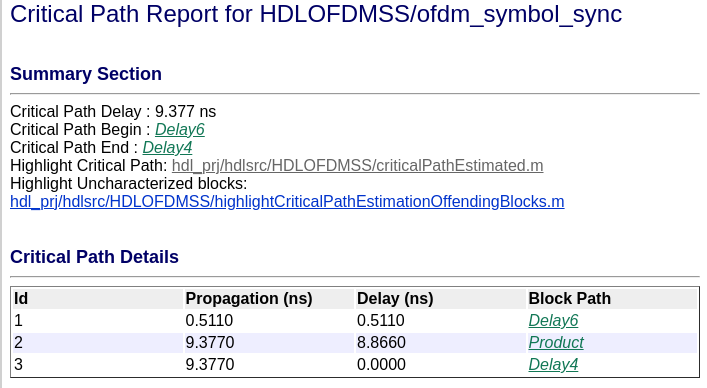
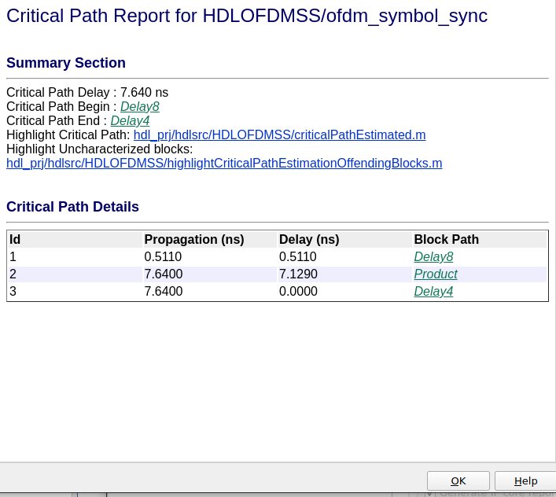
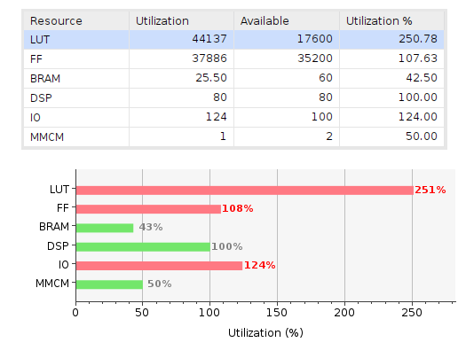
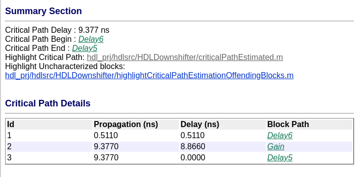

# Demodulator optimization

Primeramente, vemos que el diseño no cumple el timing por mucho. Aplicamos correcciones en los lugares donde el "adaptative pipelining" agregó delays.



Luego de tocar un poco, el problema de timing depende del bloque que obtiene el ángulo de un número complejo.



Por suerte, cuando se genera el código HDL, este bloque es reemplazado por varios bloques visibles.

Por lo que se genera el código HDL, y se reemplaza el bloque "complex to magnitude-angle" por su representación "expandida", y se agregan los delays necesarios para reducir su timing.

Al desactivar todas las optimizaciones el bloque se comportó normal. Vemos que el timing no cumple para el multiplicador de muchos bits, por lo que hay que bajar la resolución un poco.



Actualmente la resolución de ese multiplicador es fixdt(1, 32, 24).

Para optimizar los multiplicadores complejos, matlab genera a mano la multiplicación y suma para obtener el equivalente.



Para evitar que se rompa, el bloque que calcula el "frequency offset" se lo configura para que no pueda ser optimizado.



Al correr nuevamente la generación de HDL, el bloque este es un HDP:


Cuál es el problema? Cuando corrí sin optimizaciones, el problema de delay estaba en el multiplicador complejo. Pero cuando corro con optimizaciones y deshabilito la optimización para el bloque, ahora es ese bloque el que molesta el delay...

Procedo a cambiar los multiplicadores complejos por su versión "extendida". Este es el resultado SIN OPTIMIZACIONES:



El camino crítico no dependía de como estaba definido el complex multiplier, sino de la cantidad de bits.

Actualmente la resolución de ese multiplicador es fixdt(1, 32, 24). La bajo a fixdt(1, 24, 18):



En conclusión, la resolución máxima queda limitada por el timing. El problema es que al bajarle la resolución, deja de coincidir con la referencia dorada. Hay que hacer un análisis más profundo de cómo funcionan el transmisor y receptor en conjunto con el ADC y DAC.


## Sintesis

Utilización con:

```m
CONST.ADCDataType = fixdt(1, 14, 13);

CONST.FIFOOFDMSize = 1200;

CONST.rxNCOWordLength = 16;
CONST.rxNCOFractionLength = 14; 

CONST.rxDecimatorCoefficientsDataType = fixdt(1,16);
CONST.rxDecimatorOutputDataType = fixdt(1,16,14);

CONST.rxMDataType = fixdt(1,16,14);
CONST.rxRDataType = fixdt(1,32,24);
CONST.rxPDataType = fixdt(1,16,12);

CONST.rxOFDMDemodDataType = fixdt(1,16,14);

CONST.rxChannelEstReferenceWordLength = 16;
CONST.rxChannelEstReferenceFractionLength = 14;

CONST.rxQAMDemodDataType = fixdt(1,16,10);
```



Vamos a tratar de reducir la utilización de DSP, analizando bloque por bloque.

## Downshifter

Hay un delay importante en el multiplicador que calcula la frecuencia de offset.



Se cambia la lógica para reducir el tamaño del multiplicador, y también se saca un multiplicador del "ofdm_ss".
