# Demodulator optimization

Primeramente, vemos que el diseño no cumple el timing por mucho. Aplicamos correcciones en los lugares donde el "adaptative pipelining" agregó delays.


Luego de tocar un poco, el problema de timing depende del bloque que obtiene el ángulo de un número complejo.


Por suerte, cuando se genera el código HDL, este bloque es reemplazado por varios bloques visibles.

Por lo que se genera el código HDL, y se reemplaza el bloque "complex to magnitude-angle" por su representación "expandida", y se agregan los delays necesarios para reducir su timing.

Al desactivar todas las optimizaciones el bloque se comportó normal. Vemos que el timing no cumple para el multiplicador de muchos bits, por lo que hay que bajar la resolución un poco.


Actualmente la resolución de ese multiplicador es fixdt(1, 32, 24).

Para optimizar los multiplicadores complejos, matlab genera a mano la multiplicación y suma para obtener el equivalente.


Para evitar que se rompa, el bloque que calcula el "frequency offset" se lo configura para que no pueda ser optimizado.


Al correr nuevamente la generación de HDL, el bloque este es un HDP:


Cuál es el problema? Cuando corrí sin optimizaciones, el problema de delay estaba en el multiplicador complejo. Pero cuando corro con optimizaciones y deshabilito la optimización para el bloque, ahora es ese bloque el que molesta el delay...

Procedo a cambiar los multiplicadores complejos por su versión "extendida". Este es el resultado SIN OPTIMIZACIONES:


El camino crítico no dependía de como estaba definido el complex multiplier, sino de la cantidad de bits.

Actualmente la resolución de ese multiplicador es fixdt(1, 32, 24). La bajo a fixdt(1, 24, 18):


En conclusión, la resolución máxima queda limitada por el timing. El problema es que al bajarle la resolución, deja de coincidir con la referencia dorada. Hay que hacer un análisis más profundo de cómo funcionan el transmisor y receptor en conjunto con el ADC y DAC.


## Sintesis

Utilización con:

```m
CONST.ADCDataType = fixdt(1, 14, 13);

CONST.FIFOOFDMSize = 1200;

CONST.rxNCOWordLength = 16;
CONST.rxNCOFractionLength = 14; 

CONST.rxDecimatorCoefficientsDataType = fixdt(1,16);
CONST.rxDecimatorOutputDataType = fixdt(1,16,14);

CONST.rxMDataType = fixdt(1,16,14);
CONST.rxRDataType = fixdt(1,32,24);
CONST.rxPDataType = fixdt(1,16,12);

CONST.rxOFDMDemodDataType = fixdt(1,16,14);

CONST.rxChannelEstReferenceWordLength = 16;
CONST.rxChannelEstReferenceFractionLength = 14;

CONST.rxQAMDemodDataType = fixdt(1,16,10);
```


Vamos a tratar de reducir la utilización de DSP, analizando bloque por bloque.

## Downshifter

Hay un delay importante en el multiplicador que calcula la frecuencia de offset.


Se cambia la lógica para reducir el tamaño del multiplicador, y también se saca un multiplicador del "ofdm_ss".

Luego de reducir el multilpicador, vemos que el slack de setup del camino crítico se redujo

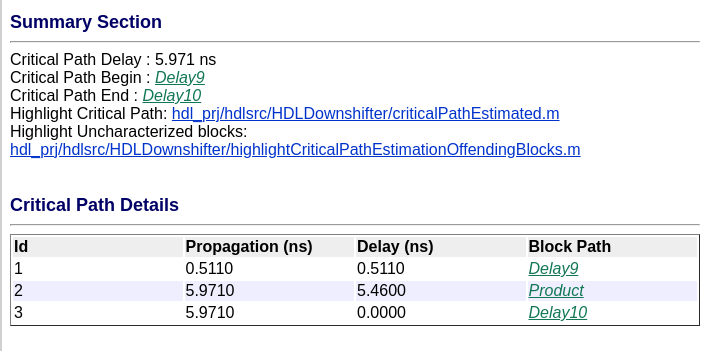

La síntesis en Vivado da la siguiente utilización de recursos y timing:

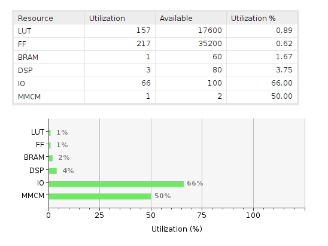

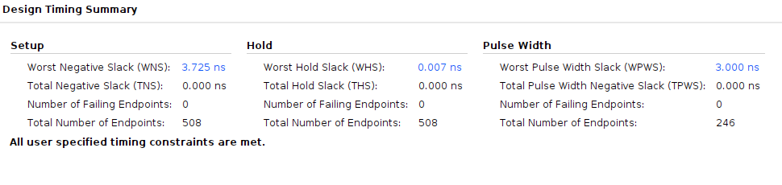

## Decimator

No hay problemas con el timing, pero si veo que Matlab me informa que se usan muchos multiplicadores. Actualmente, el decimador tiene 49 coeficientes, y un delay de 24.

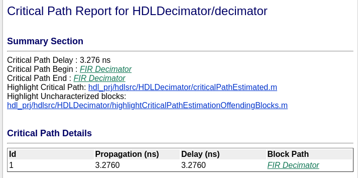

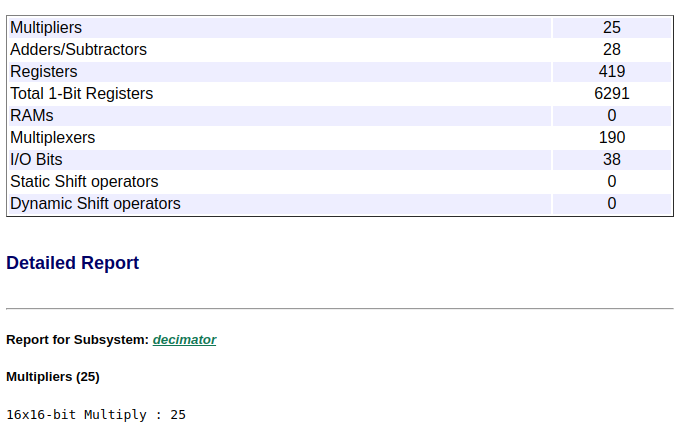

Matlab decía 25 multiplicadores, Vivado dice 25 DSP.

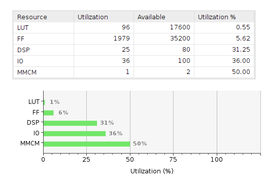

Luego de modificar un poco el decimator y hacerlo menos estricto, se logro reducir la cantidad de multiplicadores a 15:

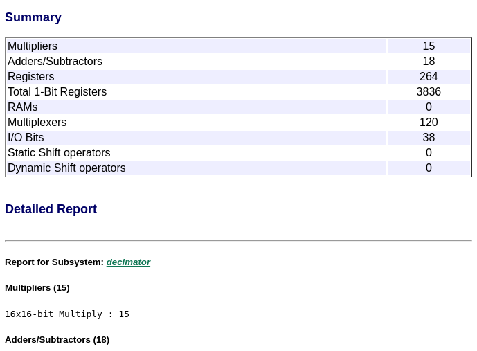

Nota: reducir el tamaño de palabra de 16 bits a 12 bits no redujo la cantidad de multiplicadores usados por Vivado.

## OFDM Symbol Sync

La utilización de recursos da multiplicadores, pero son de 32 bits, ojo:

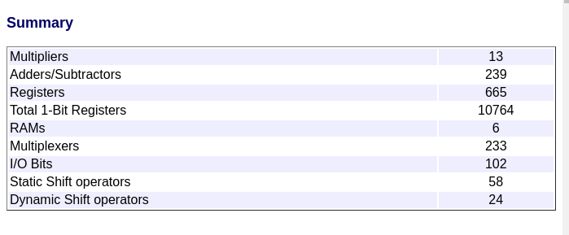

TODO: volver a este bloque por problemas de timing, ahora estoy con utilizacion.

## OFDM Demod

Con respecto al timing, esto se puede solucionar con multiple cycle paths:

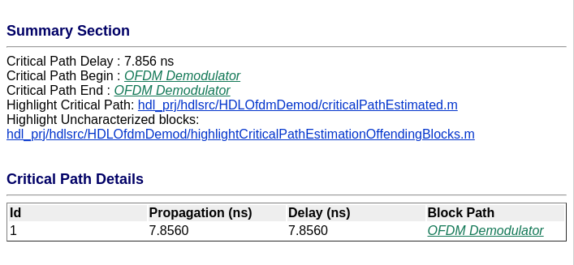

Respecto a la utilización de recursos, 12 multiplicadores.

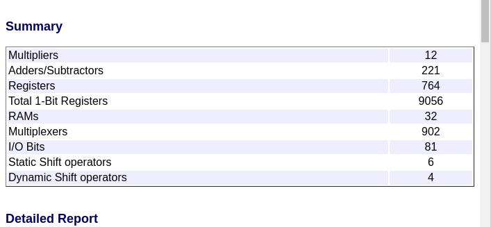

## OFDM Equalizer

El timing da bien, pero va a haber que usar multiple cycle path constraints.

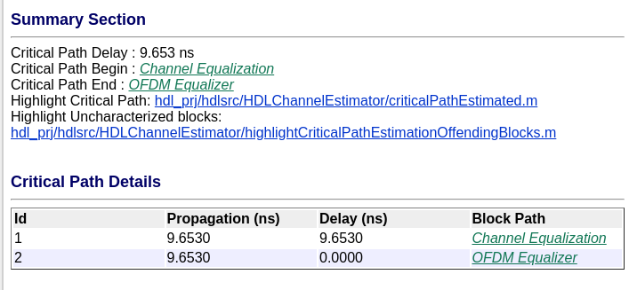

La utilización de registros dio un poco alta, por lo que se cambiaron algunos delays por block rams. 20 multiplicadores.

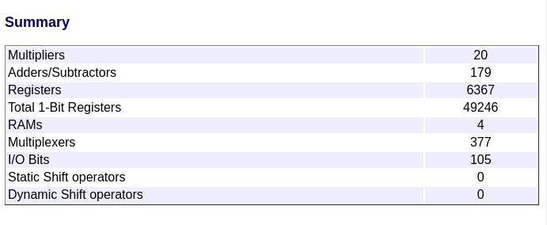

## QAM DEMOD

Encontré el bloque que consumía muchos recursos:

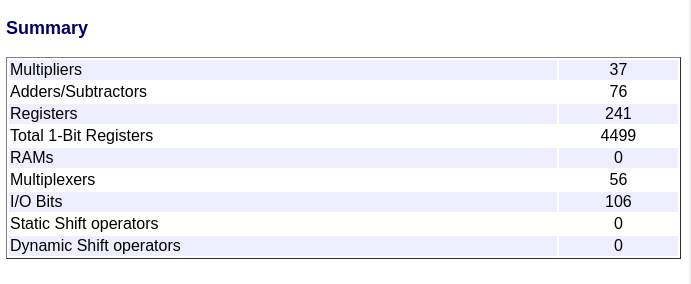

Actualmente, está instanciada la demodulación para 16QAM, pero solamente se usa hasta 4QAM, así que saco los bloques para 2QAM y 16QAM, y simplifico un poco la lógica.

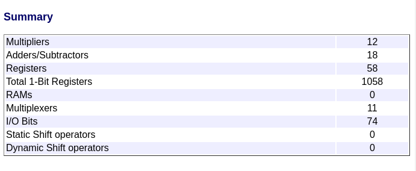

## Generación de Demodulador completo luego de los cambios de arriba

Como podemos ver, todavía estamos arriba de los 80 DSP que tiene la Red Pitaya. 

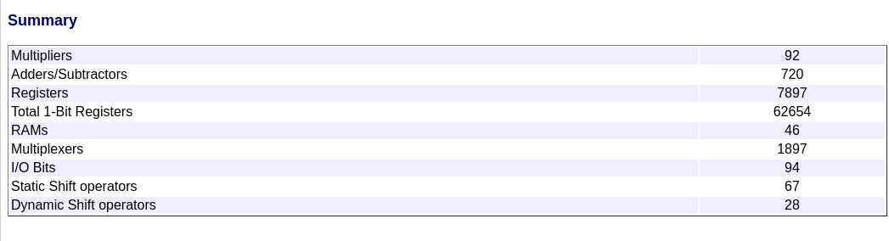

La utilización de recursos actual está en 92 multiplicadores, de los cuales:

* 12 del OFDM Demodulator.
* 3 para calcular R.
* 2 para calcular P.
* 4*2 de los multiplicadores complejos.
* 30 del decimador.
* 1 del downshifter.
* 2 del digital_carrier_receiver
* 1 del ofdm_separator.
* 1 del psdu_size_to_payload_len
* 12 del OFDM Channel Estimator.
* 8 del OFDM Equalizer
* 12 del 4QAM_demod

Además, recordar que hay 2*2 DSP usados por los LDPC decoders.

Vemos que el decimador, que debería consumir 15 multiplicadores, terminó consumiendo 30.

Luego de investigar, se descubrió que los datos de entrada y salida eran del tipo complejo. Al ser complejos, se explica que se duplique la utilización de recursos.

Entonces, hay que seguir reduciendo DSPS, un total de 16 como mínimo (para usar los 80 de la red pitaya).

## Optimización fina

Bloques fijos de matlab hay muchos que no se pueden modificar.

Se hicieron las siguientes optimizaciones:

* 2DSP: Se reemplazo el complex multiplier de 4 DSP por la implementación optimizada de 3 DSP.

* 12DSPs: Se reemplazo el bloque OFDM Channel Estimator por una implementanción manual que no usa DSPs.

Luego de las optimizaciones finales, el bloque del demodulador quedo así:

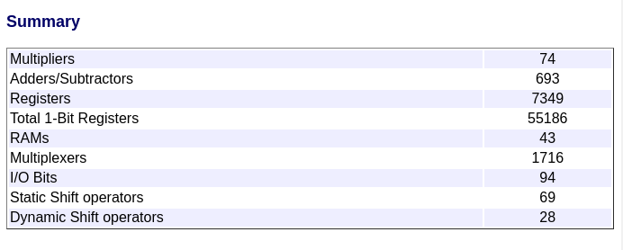

