# Header optimization

Camino crítico antes de optimizar.

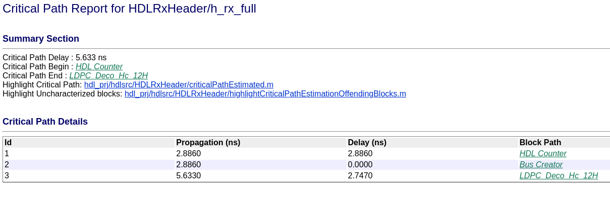

El camino crítico se debe a la falta de delays a la entrada y salida del LDPC decocer. Se le agregan delays

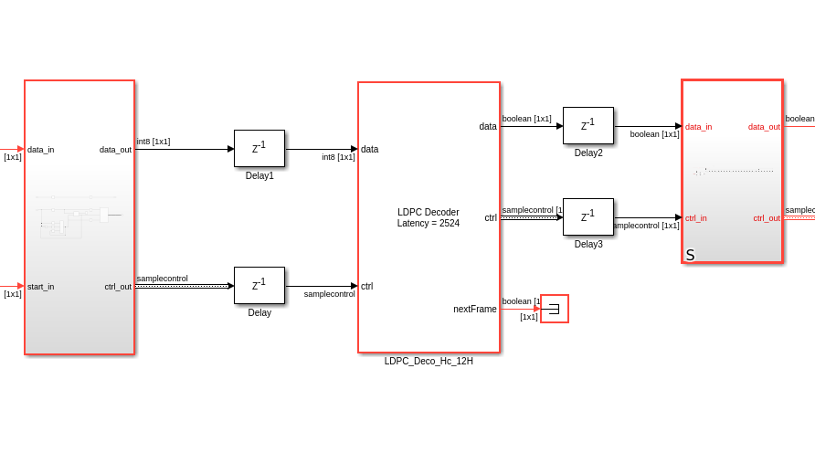

El camino crítico final queda determinado por un contador, es decir, no se puede bajar más.

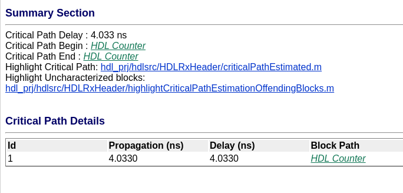

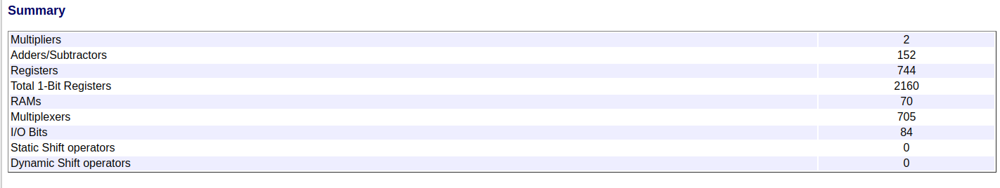

## Reduciendo la latency del LDPC decoder

Para reducir el tamaño de las RAMs, es necesario reducir el tiempo que tarda en procesar este bloque.

Según la documentación de Matlab, el delay no depende del tamaño de bits, sino de la cantidad de iteraciones.

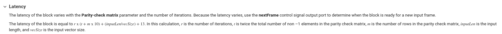

## Utilizacion de LUTs en función del tamaño de palabra

Utilizando tipo de dato fixdt(1,16,10) tenemos esta utilizacion en Matlab. Notar que se utilizan dos multiplicadores de 4x32 bits.

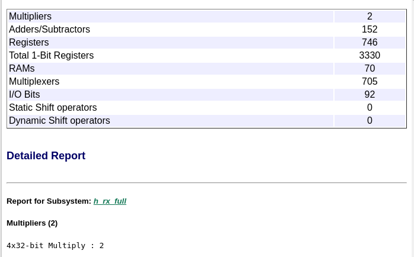

La sintesis en Vivado nos dice que todo lo consume el LDPC decoder. Notar que, interesantemente, no está usando DSPs, a pesar de tener multiplicadores. Eso puede estar causando el consumo excesivo de LUTs.

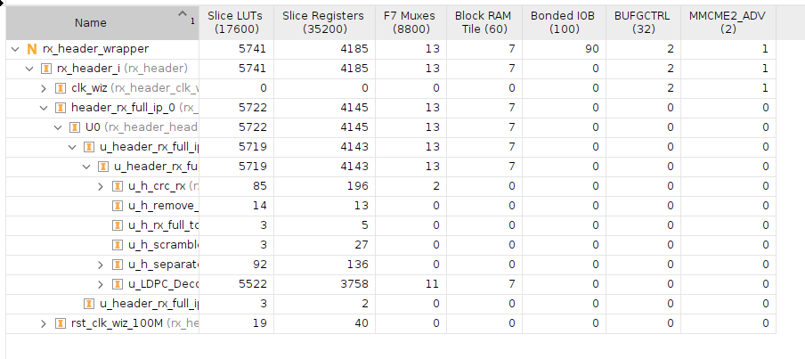

El timing a duras penas lo cumple a 125MHz, habría que ver en la implementación, pero de momento no habría necesidad de cambiar nada.

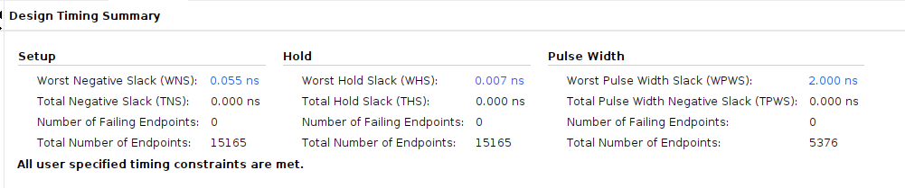

Ahora voy a ir a Matlab y poner adaptative y distributed pipelining, a ver si así el Vivado reconoce los multiplicadores como DSPs. Conclusión: no cambió nada.

Ahora, reduzco el tamaño de palabra de bits a fixdt(1,4,0). Desde Matlab se ve una reducción importante en la utilización (aunque no desapareció el multiplicador):

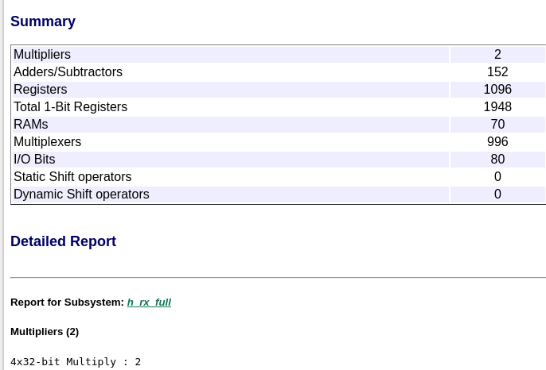

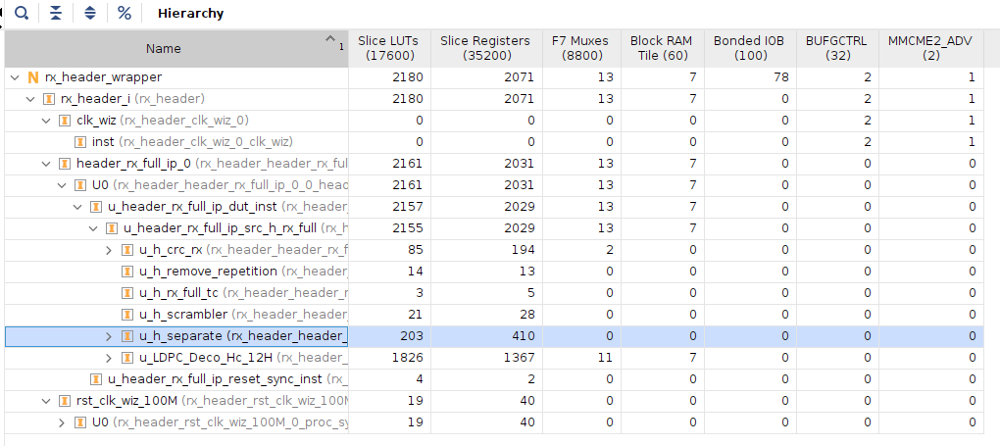

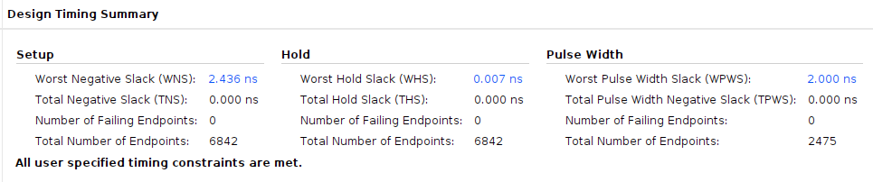

Conclusión: se va a dejar operando el LDPC decoder del header con 4 bits nomás (el tipo de dato fixdt(1,4,0) es el que usa por defecto Matlab en su ejemplo, además, los valores que toma van siempre entre +2 -2).
