# Tx payload optimization

Luego de agregar un par de delays antes y después del LDPC decoder, se reduje al mínimo posible el delay

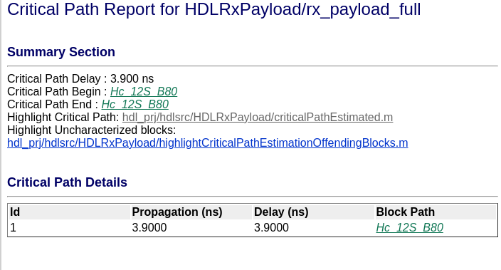

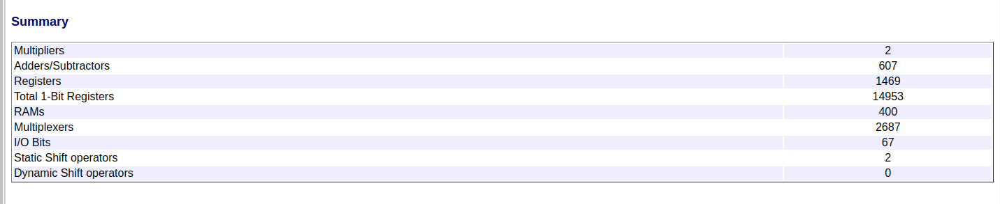

## Utilizacion del LDPC

Usando el tipo de dato fixdt(1,4,1)

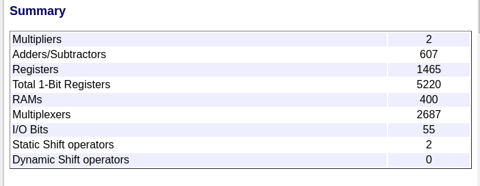

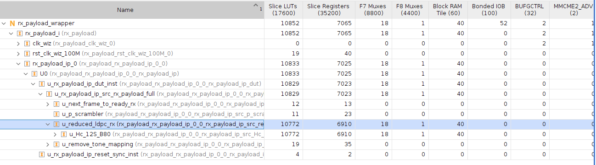

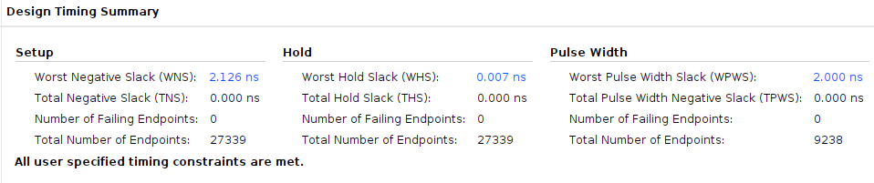

Como podemos ver, la utilización de recursos de 10000 LUTs es prohibitíbamente alta. Tengo que buscar una forma de reducir esa utilización urgente.

Lamentablemente, no hay nada que se pueda tocar, ya que el tamaño de palabra mínimo que acepta el bloque es de 4bits, y el resto de parámetros están en el mínimo.

En el siguiente ejemplo, se cambia la matriz usada para LDPC, reciclando la misma matriz usada para el header (se quiere chequear si depende de los valores en la matriz):

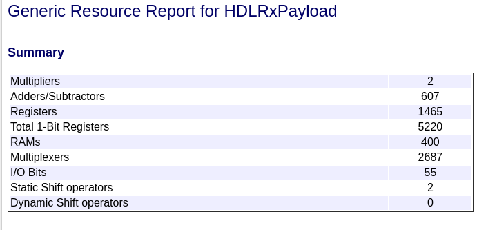

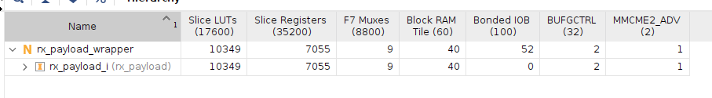

Al menos, esto demuestra que la utilización de recursos no depende del contenido de la matriz en sí.

Entonces, la única otra alternativa para reducir la utilización de recursos es usar alguna otra de las combinaciones de blockSize y FecRate. Esto es super peligroso, porque yo sé que esos dos valores están fuertemente hardcodeados en todos lados.

## Distintos tipos de LDPC decoders

ESte es el LDCP con 120 bytes y fec rate 2/3. Es extraño ver que no usa multiplicadores, pero en general veo una utilización mucho menor que con el de fec rate 1/2.

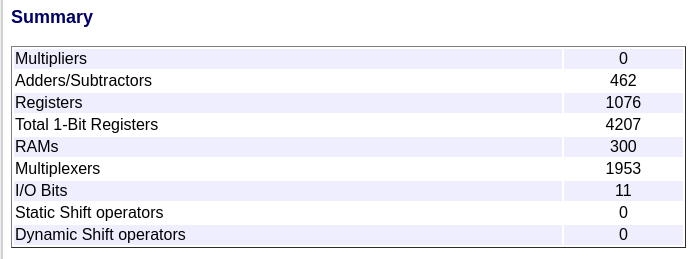

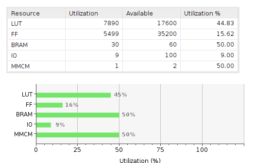

Ahora, para chequear que este test está bien hecho, reemplazo con el de fec rate 1/2.

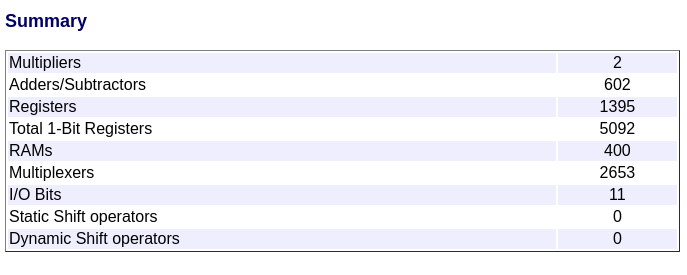

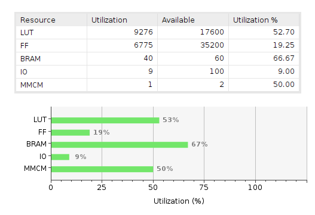

Pruebo también coon LDPC de 120 bytes y fec rate 5/6:

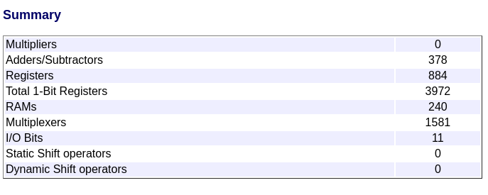

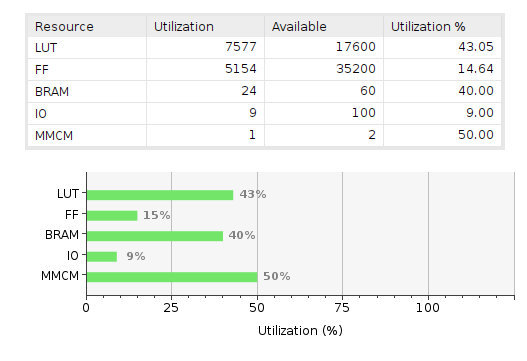
