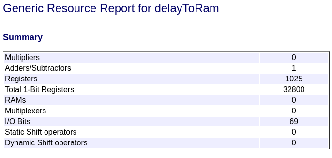
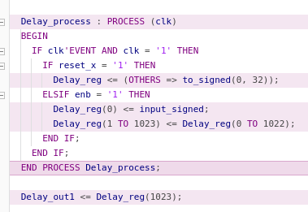

# Delay to RAM

Para poder mapear delays grandes a RAM, hay que habilitar:

* En "HDL Code Generation -> Optimization -> General", las opciones:
  * "Map pipeline delays to RAM": Mapea a RAM los delays generados por adaptative pipelining o distributed pipelining.
  * "RAM mapping threshold": Va a convertir los delays en RAM si su tamaño en bits es mayor al indicado $RAMSize = Delay length * Word length * Vector length * Complexity$. (Complexity es "2" si es un número complejo).

* Si se quiere que un delay creado por nosotros se mapee a RAM:

1. Click derecho en el bloque Delay.
2. HDL Code -> HDL Block Properties -> UseRAM = on.

Reporte de utilización de recursos original:

Reporte de utilización de recursos reemplazando delays por RAM:

No vas a ver la RAM físicamente en el modelo de Simulink, pero sí en la generación del código HDL.
