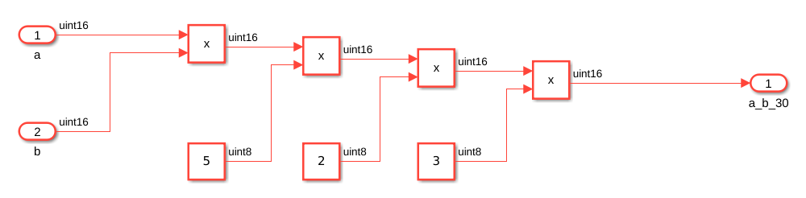
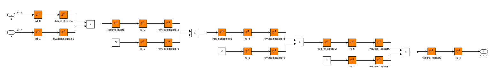
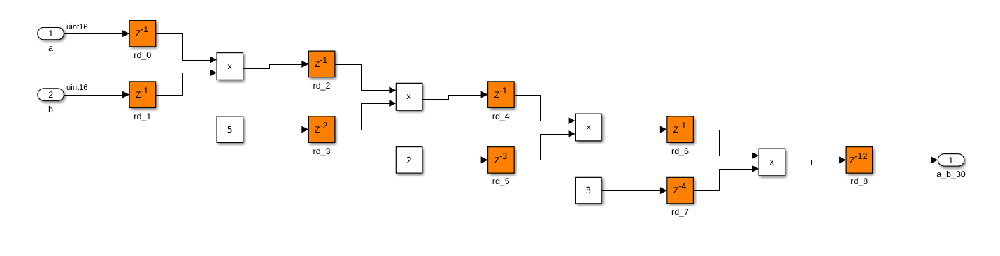
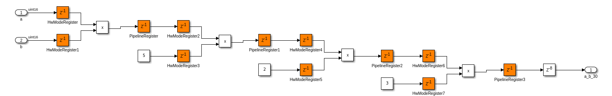
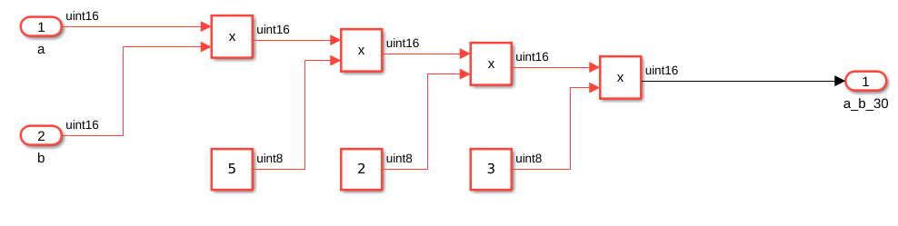
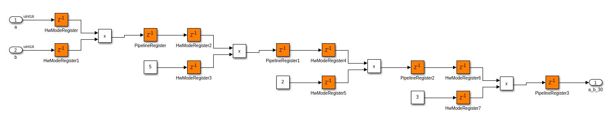
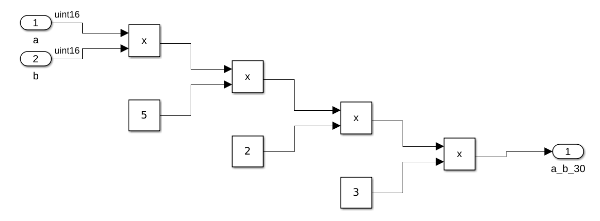

# Adaptative and distributed pipelining

Adaptative and/or distributed pipelining es una técnica que inserta u ordena los delays para mejorar el timing y la utilización de recursos.

Bloque base con delay adelante:

Bloque generado con adaptative y distributed pipelining:

Bloque generado con solamente distributed pipelining:

Bloque generado con solamente adaptative pipelining:

Bloque base sin delay:

Bloque generado con adaptative pipelining para la base sin delay:

Bloque generado con distributed pipelining para la base sin delay:

Conclusiones:

* Distributed pipelining mueve los delays ya existentes en el código, el resultado es exactamente el mismo.

* Adaptative pipelining inserta delays en el diseño para optimizar el área y el timing. El timing del bloque final puede verse modificado.
