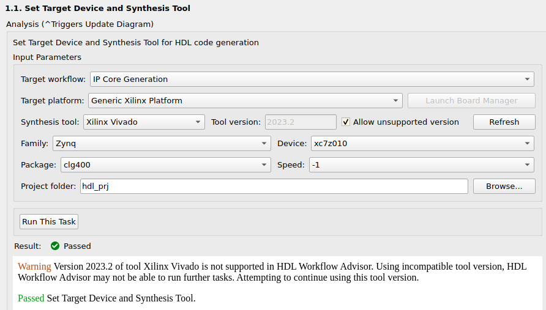
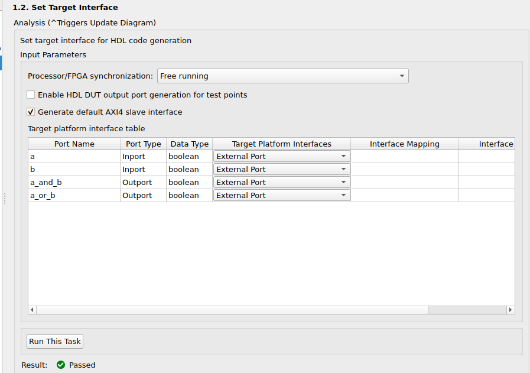
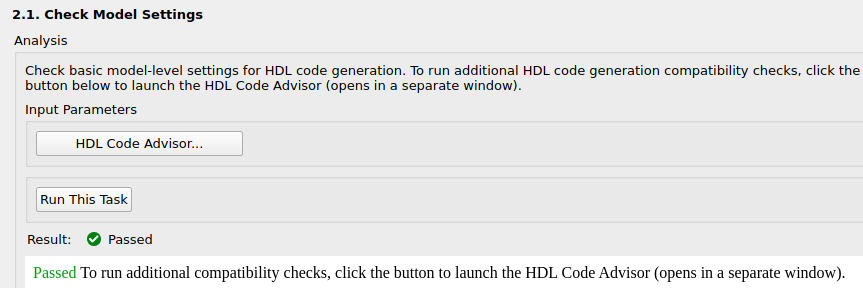
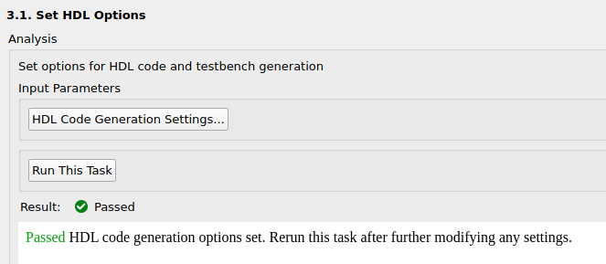
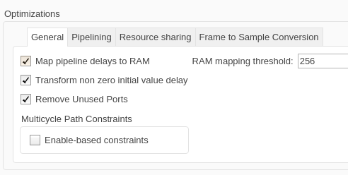

# Logic Operators

En este ejemplo, vamos a generar un IP Core y hablar de los distintos parámetros que aparecen al generar un IP Core en Matlab.

Primero, selección de la placa y el compilador de HDL, nada raro. Se usa la Red Pitaya en Vivado 2023.2

Siguiente, configuramos como se comportan las entradas y salidas del sistema. En esta pestaña hay básicamente dos opciones:

* Configurar la entrada / salida como puerto externo, para conectar con otros IP Cores.
* Configurar como AXI4.

Para este ejemplo, vamos a usar puerto externo.

En la siguiente etapa, pide "frecuencia objetivo". Si hay muchos clocks dentro del bloque, siempre poner el valor de clock más rápido.

Siguiente, es correr el HDL Code Advisor. Generalmente esto se hace antes de usar el Workflow Advisor, pero alguna configuración puede cambiar al haber seteado la plataforma "Xilinx" o la frecuencia objetivo, por lo que vale la pena volverlo a correr.

Luego, llegamos a correr las settings. Vamos a ver las settings principales y qué hay que tocar, y que no. Ante la duda, usar el "Help" dentro de Matlab.

En "Optimization -> General":

* "Map pipeline delays to RAM" ayuda a usar menos recursos lógicos, al tradearlos por RAM. Por ejemplo, si se tiene un delay de 1000 muestras, este se puede reemplazar por una RAM de 1000. Solamente reemplaza por RAM si el delay sobrepasa el valor de "RAM mapping threshold. ENCENDER SI SOBRA RAM, PERO NO LUTS.

* "Transform non zero initial value delay": Convierte los delays con valor inicial no nulo, en un delay con valor inicial nulo y una lógica adicional. SIEMPRE ENCENDIDO.

* "Remove unused ports". SIEMPRE ENCENDIDO.

* Enable-based contraints: TODO revisar.

En "Optimization -> Pipelining":

* Allow design Delay Distribution: Permite agregar y mover delays para optimizar el código generado. Hay dos modos posibles:
  * Numerical integrity: no modifica la lógica del diseño
  * Performance: modifica la lógica de las condiciones iniciales en pos de mejor performance.

* Clock-rate pipelining: Esta es una opción bastante compleja: suponga que se tienen dos partes del diseño, que tienen un multiplicador cada una: uno corriendo a 50MHz y otra a 100MHz. Al usar clocks distintos, estos multiplicadores NO pueden compartir recursos.

Clock-rate pipelining convierte el circuito corriendo a 50MHz a uno corriendo a 100MHz, repitiendo dos veces las muestras por ciclo. De esta forma, ahora ambos circuitos corren a 100MHz, lo que permite compartir y optimizar los recursos.

Esta función está muy limitada a bloques "normales", porque no soporta bloques de Wireless HDL Toolbox, HDL FIFO, HDL RAM o Serializer.

* Distributed pipelining. Mueve los delays del diseño, para adaptarse mejor a los requisitos de timing. Por ejemplo, si tengo una cadena de 4 multiplicaciones en serie, y un delay al final de 8, entonces va a distribuir dos delays a la salida de cada multiplicador. SIEMPRE ON.

* Use synthesis estimates for distributed pipelining. Mejora el resultado de distributed pipelining. SIEMPRE ON.

* Adaptive pipelining. Si se configura el target frequency y el target Xilinx, esto genera delays entre multiplicadores y sumadores para mapearlos más fácilmente a DSP48 de Xilinx, usando menos área. SIEMPRE ON.

* Map lookup tables to RAM. SIEMPRE ON.

En "Optimization -> Resource Sharing": TODO ON.

En "Optimization -> Floating Point", desactivado.

En "Optimization -> Global Settings":

* Recomiendo activar el "Treat Simulink rates as actual hardware rates". Esta función hace que el sample rate de Simulink se condiga con el usado para hardware, para calcular las optimizaciones de adaptive pipelining. Caso contrario, se puede definir un tiempo "de simulación" (por ejemplo, un segundo es un ciclo de clock), y un "oversampling Factor" que corrija al valor de hardware.

* En la sección "Model generation":
  * Activar el "Generated model": Este modelo muestra todas las optimizaciones aplicadas al modelo original. (Prefijo gm_).
  * Activar el "Validation model": Este modelo compara el modelo anterior con el optimizado, para garantizar que funcionan iguales (Prefijo _vnl).

