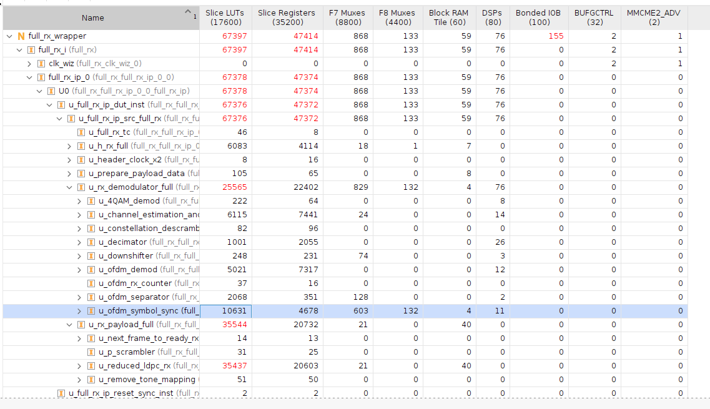
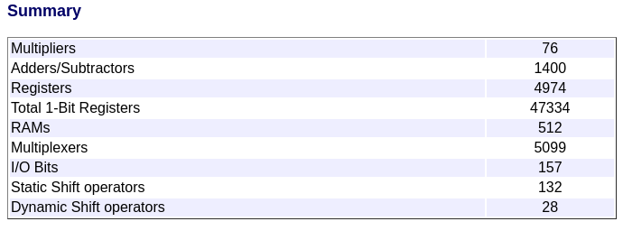
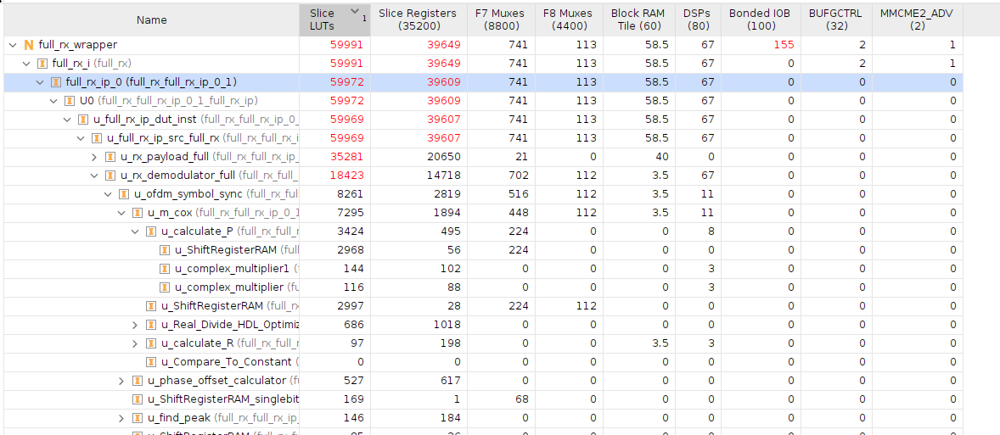
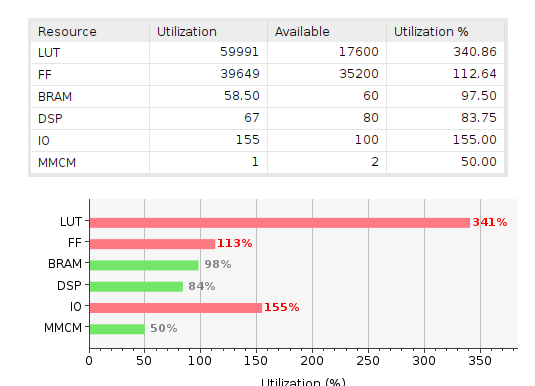

# Optimización del receptor

Empezamos con esta tabla de utilización, que viene después de todos los pasos descriptos en el test de integración del Demodulator:

Lo que se quiere lograr es reducir la utilización de recursos del header y del payload, posiblemente reduciendo el tamaño de palabra de entrada. Además, me quiero asegurar que realmente no usan DSPs. Su utilización de recursos alta depende solamente del LDPC decoder.

Algo que llama la atención es que el Demodulador sólo entró en recursos, pero ahora el demodulador con otras cosas no entra. Hay que revisar bien por qué es esto.

Ir al README del rxHeader para ver la optimización del LDPC. Ir al README del rxPayload para ver la optimización del LDPC.

Luego de haber realizado las optimizaciones pertinentes, a saber:

* Reemplazar bloque equalizador por implementación casera.

* Reducir tamaño de palabras en el receptor.

* Reducir el tamaño de los LDPCs a 4 bits.

Los resultados de Matlab y de Vivado son los siguientes:

La suma de las utilizaciones individuales no se condice con la utilización total. La razón está en la imagen de arriba. Se alcanzó el 100% de la utilización de RAM, y empezó a usar LUTs como RAM.

Pequeño detalle que habíamos dejado pasar: el payload ocupa 40 de 60 BRAMs. El header 7/60. El Demodulador 19/60. Entonces, no solo estamos pasados de LUTs, también estamos pasados de RAM.

En conclusión, lo único que se puede hacer es eliminar el LDPC del payload, y reutilizar el del header tanto para el encabezado como para el payload.
